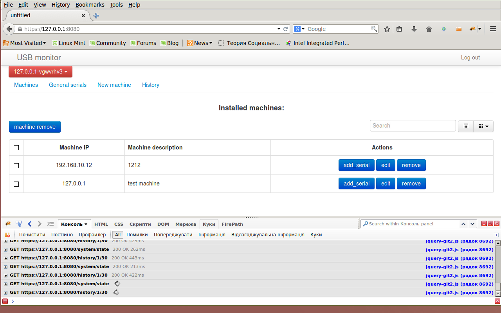
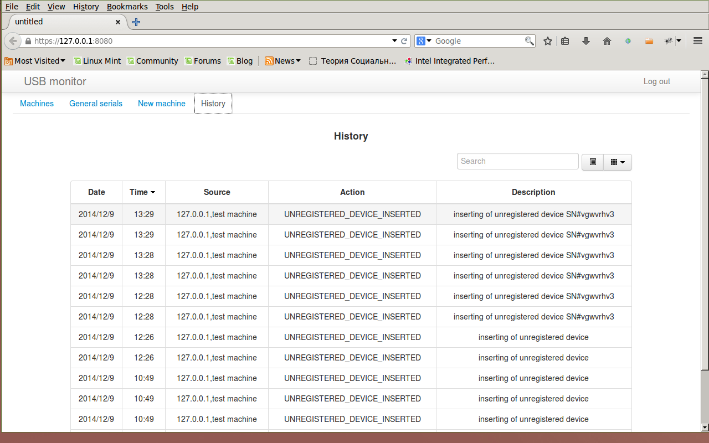

usb-flash-network-monitor
=========================

usb flash guard over network acording to the registered serial numbers

Connect SMS informing
---------------------

Register at :
http://www.epochta.ua/sms-rozsilka-servis/
and fill in usb.conf user login and pass splitted with ':'

Server installation
-------------------

0. install python 2.7 and dependencies (bottle,simplejson,peewee)
1. Set the HOME env. variable in your env-script
2. Set the USB_CONFIG_FILE env.variable in your env-script
3. cp ./server somedir
4. put in to boot system script command `python control_server.py`
5. edit USB_CONFIG_FILE

Client installation
-------------------
0. install python 2.7 and dependencies (bottle,simplejson,configparser,pyudev,evdev,pyusb)
1. Set the HOME env. variable in your env-script
2. Set the registered_usb_devices env.variable in your env-script
3. cp ./client somedir
4. put in to boot system script command `python daemon.py &`
5. edit registered_usb_devices

! run client-side from the ROOT!

Certificates
------------
to create a server certificate, run eg

openssl req -new -x509 -keyout server.pem -out server.pem -days 365 -nodes

DON'T distribute this combined private/public key to clients!